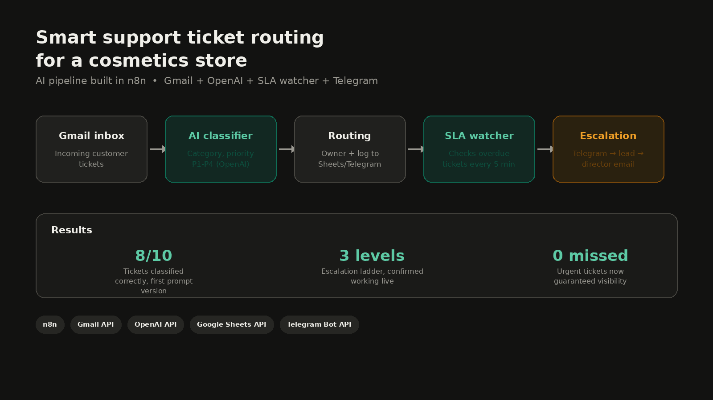
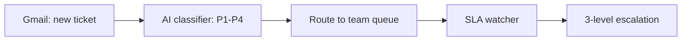

# n8n AI Ticket Router
> Routes incoming Gmail support tickets to the right team automatically, with built-in SLA escalation.

## Problem
Support tickets arrive by email with no consistent triage. Urgent issues
sit in a shared inbox next to low-priority requests, and nothing tracks
whether a ticket is approaching its SLA deadline.

## Solution
An n8n workflow reads incoming Gmail messages and classifies each ticket
into a priority level (P1–P4) using a chain-of-thought LLM prompt, then
routes it to the right queue. A second workflow watches open tickets and
escalates them through three SLA warning levels if they aren't resolved
in time.

## How it works

## Tech stack
n8n | Gmail | OpenAI (chain-of-thought classification) | SLA escalation logic

## Author
Andrii Shevchuk, AI Automation Engineer | n8n & AI Agents
[LinkedIn](https://www.linkedin.com/in/sh-dev-a-ai/) · [Upwork](https://www.upwork.com/freelancers/~01c28bbcb1e0c08170?mp_source=share) · [Portfolio](https://jasper-spur-64b.notion.site/Andrea-Shevchuk-3746e46a716e80ae90e0f73434dbfb92?source=copy_link)

## License
MIT
